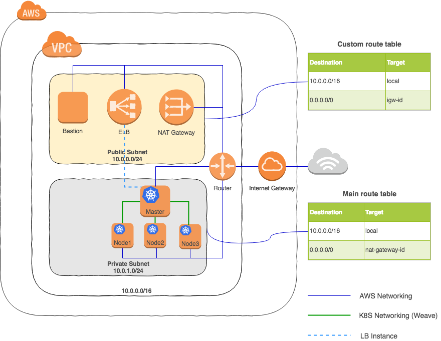

# A basic kubernetes cluster setup in AWS #

Tools used :

  * `kubeadm` - automating kubernetes cluster deployment
  * `terraform` - declarative infrastructure orchestration
  
## AWS networking setup ##

AWS Virtual Private Cloud (VPC) is used to setup a configuration which will provide the basic infrastructure for the kubernetes cluster. The configuration consist of a mix of public and private subnets that, along with routing tables & security groups,  will take care of networking between instances inside VPC and also with public internet.

**Terraform** provides a nice platform to declaratively implement the above configuration. It comes with its own DSL and has sophisticated support for AWS via the `aws` provider.

Below image shows key components of the configuration

Public subnet's agenda is to expose it's componenets to public internet. It uses the `custom` route table for the same. `custom` route table contains an entry which enable instances to talk to public internet over IPv4 via the internet gateway (igw). Other entry of the same route table is for communication between instances within VPC.

Similarly, private subnet protect it's instances from any direct inbound communication from public internet. However, it enable outbound communication of it's instances with public internet (for tasks like software updates) via the NAT gateway (which is located in public subnet). This arrangement is made possible by `main` route table of the VPC. `main` route table is associated with the private subnet for the reason that any future subnets should be private by default.

A classic load balancer is the public facing entry point for the applications deployed in kubernetes cluster. On a relevant request, it redirects to the registered `master` node of the private kubernetes cluster that in turn serves the application. Security groups configuration for both the load balancer as well as the `master` node is important for succesful redirection of requests.

Bastion host's sole purpose is to provide  developers' access to private kubernetes cluster's instances via ssh.

For this prototype, a one master three node (worker) kubernetes cluster is created. `kubeadm` automates the process of setting up the required cluster infrastructure components like `kubedns` & `kubeproxy`. A pod network is required for pods to communicate with each other before any application deployment takes place inside the cluster; Weave Net is the pod network of choice here.

### Implementation ###

Terraform's `aws` provider takes care of creation of most the aws specific resources as shown in the above image. `variables.tf` consist of deployment specific parameters thereby making the overall implementation reusable. `main.tf` consist of complete infrastructure orchestration code which is self explanatory provided the above image is used as reference. We will discuss couple of interesting implementations here:

**Security group configurations**

Security group configurations for both load balancer and kubernetes' nodes are important for successful routing of the requests. Load balancer is configured with the `master` node of kubernetes cluster as the instance to which it will redirect requests coming from public internet. For the same to happen, load balancer's security group exposes application port (in case of a web application it might be `80`) and at the same time `master` node need to allow requests coming from the load balancer on the specific port on which the application is being served. It might differ from the application port that load balancer exposes e.g. front-end service of the sample Sock Shop Demo application deployed inside kubernetes exposes it via port `30001` which is different from port `80` exposed by the load balancer for public internet to consume. Load balancer listener configuration takes care of this mapping from `80` to `30001` with `HTTP` as protocol. Let's see how Terraform enable these arrangements to be made declaratively

First up some variable definitions for application port and port that node exposes:

    variable "node_port" {
      default = "30001"
    }
    
    variable "lb_app_port" {
      default = "80"
    }
    

Security group configuration of load balancer that accepts request from everyone on the app port and also allow every outbound communication

    resource "aws_security_group" "elb" {
      name = "elb"
      description = "redirect all http traffic towards master k8s node"
      vpc_id = "${aws_vpc.cluster.id}"
      
      ingress {
        from_port = "${var.lb_app_port}"
        to_port = "${var.lb_app_port}"
        protocol = "tcp"
        cidr_blocks = ["0.0.0.0/0"]
      }
    
      egress {
        from_port = 0
        to_port = 0
        protocol = "-1"
        cidr_blocks = ["0.0.0.0/0"]
      }
      
      tags {
        Name = "elb"
      }
    }
    
Security group configuration for `master` node which allow requests made from load balancer (configured via mentioning it's associated security group) to the port on which the application will be exposed

    resource "aws_security_group" "kubernetes_master" {
      name = "kubernetes_master"
      description = "allow http requests only from elb"
      vpc_id = "${aws_vpc.cluster.id}"
      
      ingress {
        from_port = "${var.node_port}"
        to_port = "${var.node_port}"
        protocol = "tcp"
        security_groups = ["${aws_security_group.elb.id}"]
      }
      
      tags {
        Name = "kubernetes_master"
      }
    }
    
Finally, it all fits when the load balancer resource itself is created where listener configuration maps load balancer's exposed port to the port of `master` node on which application is listening over the relevant protocol (in this case `HTTP`)

    resource "aws_elb" "cluster_lb" {
      name = "cluster-master-node-lb"
      security_groups = ["${aws_security_group.elb.id}"]
      subnets = ["${aws_subnet.public.id}"]
      instances = ["${aws_instance.master.id}"]
    
      listener {
        instance_port = "${var.node_port}"
        instance_protocol = "HTTP"
        lb_port = "${var.lb_app_port}"
        lb_protocol = "HTTP"
      }
      
      tags {
        Name = "cluster-master-node-lb"
      }
    }
    

**kubeadm setup & execution**

`kubeadm` need to be setup as the instances are launched and thereby initialise the kubernetes cluster. Terraform's `template` data sources feature is leveraged to provide the necessary `user data` payload that `aws` execute once instances are launched. `master_setup.sh` and `nodes_setup.sh` are the respective shell scripts that take care of installing `kubeadm` along with pre-requisites like `docker`& `kubectl` both in master and nodes. Additionally, in `master` the script file creates the cluster with the token provided as a Terraform variable (`k8s_token`) and install the pod network. Simillarly, in the nodes (workers) the script file make them join the `master` thereby fully establishing communication between all nodes of the cluster.

Terraform template data source declaration of the setup script for `master` where `kubeadm` token is passed as argument

    data "template_file" "master-userdata" {
        template = "${file("${var.master_setup_data_file}")}"
    
        vars {
            k8s_token = "${var.k8s_token}"
        }
    }
    
Same is being used as `user_data` in the `master` instance resource creation

    resource "aws_instance" "master" {
      ami = "${data.aws_ami.ubuntu.id}"
      instance_type = "${var.aws_ami_type["master"]}"
      subnet_id = "${aws_subnet.private.id}"
      key_name = "${aws_key_pair.nodes.key_name}"
      associate_public_ip_address = true
      vpc_security_group_ids = ["${aws_security_group.kubernetes.id}", "${aws_security_group.kubernetes_master.id}"]
      user_data = "${data.template_file.master-userdata.rendered}"
    
      tags {
        Name = "master"
      }
    }

### Execution  ###

**Pre-requisite**

  * Install AWS CLI and configure it with relevant credentials & other region specific information
  * Install Terraform in the host machine
  
**Process**

  * `terraform init` - will scan and download the relevant providers - `aws` and `data-template` in this case
  * `terraform plan -out plan.out` - will compile the overall implementation, check for any errors and also dry-run to produce an execution plan. The same is exported as `plan.out`
  * `terraform apply plan.out` - finally applying the computed plan. This will make the necessary changes in AWS. 
  
In case of any changes made after the initial execution of the plan, running `terraform apply` again will only execute the necessary changes to the infrastructure. This incremental execution feature of Terraform provide necessary sophistication & also help versioning infrastructure orchestration.

### Resources  ###

The design and implementation of this prototype is influenced from many well documented resources. Few of the important one's are listed here along with some references :

  * [AWS Documentation - VPC with Public and Private Subnets (NAT)](http://docs.aws.amazon.com/AmazonVPC/latest/UserGuide/VPC_Scenario2.html)
  * [AWS Documentation - How do I connect a public-facing load balancer to EC2 instances that have private IP addresses?](https://aws.amazon.com/premiumsupport/knowledge-center/public-load-balancer-private-ec2/)
  * [Kubernetes Documentation - Using kubeadm to Create a Cluster](https://kubernetes.io/docs/setup/independent/create-cluster-kubeadm/)
  * [Github Project - Bootstrap a Kubernetes cluster on AWS using Terraform and kubeadm](https://github.com/upmc-enterprises/kubeadm-aws)
  * [Terraform Documentation - aws provider](https://www.terraform.io/docs/providers/aws/index.html)
  * [Terraform getting started](https://www.terraform.io/intro/getting-started/install.html)
  * [Installing AWS Command Line Interface](http://docs.aws.amazon.com/cli/latest/userguide/installing.html)

  
